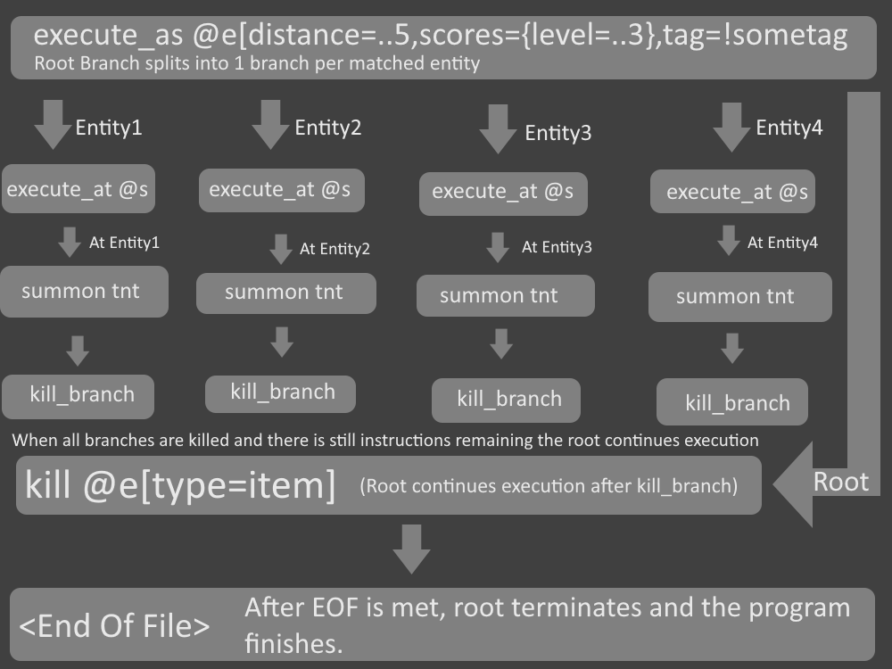

# Example for expected compilation results

## MCFUNCTION

```mcfuncion
execute as @e[distance=..5,scores={level=..3},tag=!sometag] at @s run summon tnt ~ ~ ~
kill @e[type=item]
```

## Disasembled MCFN Bytecode

```Disasembled MCFN
execute_as @e[distance=..5,scores={level=..3},tag=!sometag]
execute_at @s
summon tnt
kill_branch
kill @e[type=item]
```

## Flow


